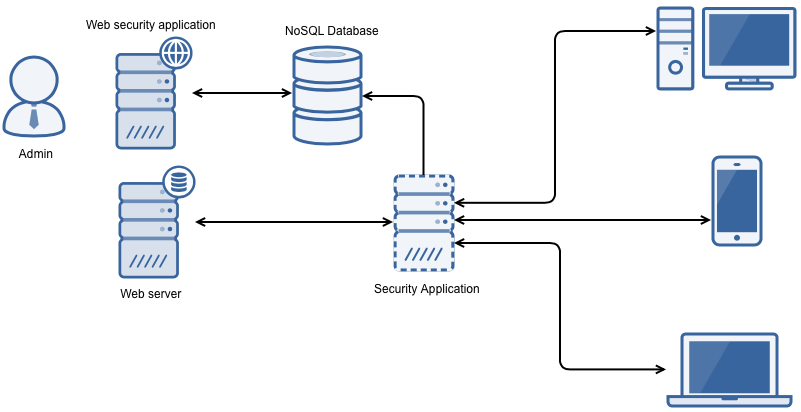

# securing-backend

## Synopsis

Concept of securing backend programmed in python. Application is executed on server, after that it listens on specific port. For every input http request - reads it and sends it to actual server. In input http request serachs wtih module library web attack etc sql injection (diagram).

## Prerequisites

* Python3
* [MongoEnginge](http://mongoengine.org)
* Pymongo library
* MongoDB
* Tabulate library
* geolite2
* maxmindb

All these python libraries you can install with pip

## Installation

Working on installation script. At the current state whole repo has to be installed on server specific location.

## To do list
Short to do list what project needs

* Security ssl may contain bugs as for secure data and mongoDB connection
* Reading https is currently biggest problem
* Add more rules for more web attacks and exploits
* Get rid of bugs
* More tests

## Tests

There is specific mount of tests more are comming.

## Contributors

Let people know how they can dive into the project, include important links to things like issue trackers, irc, twitter accounts if applicable.

## License

This project is licensed under the MIT License - see the [LICENSE.md](LICENSE.md) file for details
